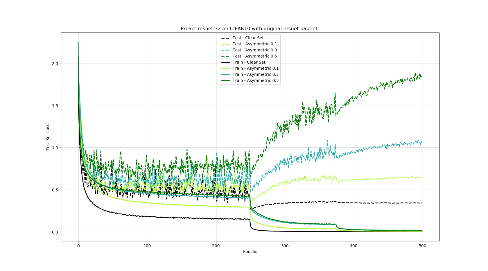
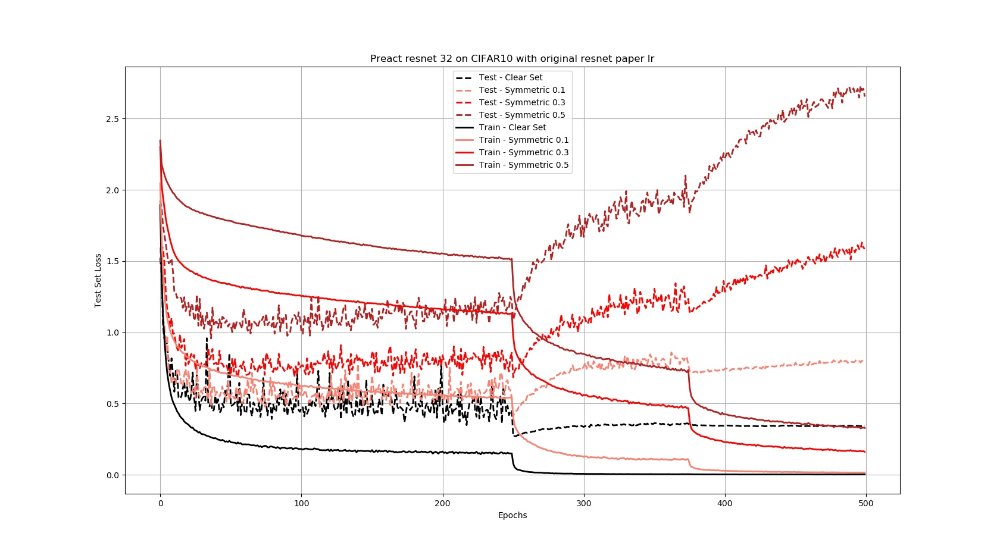
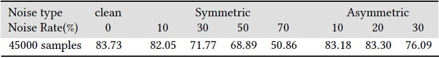

# baselineModel
A basic learning model in order to investigate the effect of label noise on the performance of a classifier using neural networks.

## Summary

  - [Description of the problem](#description-of-the-problem)
  - [Description of the repository](#description-of-the-repository)
  - [Requirements](#requirements)
  - [Usage](#usage)
  - [Experiments](#experiments)
  - [Results](#results)
  - [Acknowledgments](#acknowledgments)

## Description of the problem

We develop a model to investigate experimentally the effects that noisy labels have. More specifically, we will build a basic model of learning (baseline) with neural networks, without the existence of mechanisms that help in the fight against label noise, to use it as a reference point (and therefore easily compare it with other methods). We will use a simple learning model, which would work very well with clean labels. Then we will artificially introduce different noise levels and in the end, we will observe the effect on the classifier performance.

More specifically we will use a preact ResNet32 as network and we use the same settings and paramaters with the implementation of the original paper of ResNet.

## Description of the repository

```
    .
    ├── data                    # contains folders for each dataset separately
    │   └── cifar10
    ├── utils                   # help functions
    │   ├── cifar10v3.py        # definition for Cifar10 dataset class
    │   ├── mypreactresnet.py   # definition for preact ResNet32 model
    |   └── parsearguments.py   # help file to parse arguments
    ├── 10000.npy               # 10000 samples from dataset
    ├── 15000.npy               # 15000 samples from dataset
    .
    .
    .
    ├── baseline.py             # implementation of PENCIL framework
    ├── check_distributions.py  # help file for plots
    ├── clean.npy               # clean dataset used by check_distributions for plot
    └── ...
```

## Requirements
    python = 3.7.4
    numpy = 1.17.3
    pytorch = 1.4.0
    torchvision = 0.5.0
    matplotlib = 3.1.1
    pillow=6.2.0


## Usage
Examplea for running the method are :

    python baseline.py --noise clean --noise_rate 0.0 --optimizer SGD --epochs 200 --lr 0.2 --sample 15000
    
    python baseline.py --noise symmetric --noise_rate 0.1 --optimizer SGD --epochs 200 --lr 0.2 --sample 45000
    
    python baseline.py --noise asymmetric --noise_rate 0.1 --optimizer SGD --epochs 200 --lr 0.2 --sample 30000

## Experiments

For our experiments we used the CIFAR-10 data set. We dealed with symmetric and asymmetric noise and followed the procedure applied in original paper of PENCIL for introducing noise. Let the noise percentage of the labels is 𝑝 ∈ [0, 1]. In the case of symmetric noise, a label is changed to one of all the other 9 classes with probability 𝑝, while remains clean with probability 1−𝑝. As for the asymmetric noise, the changes in a class can be made according to the following correspondences: bird->plane, truck->car, deer -> horse and cat <-> dog. That is, labeling errors correspond to classes that have visual similarities. 
For this simple model, we use the same settings and paramaters with the implementation of the original paper of ResNet.

## Results
Ηere is an image with a test loss vs epochs chart for asymmetric noise



and here for symmetric noise



Finally, the following table illustrates results for experinments with different noise types and noise rates 𝑝.



## Acknowledgments
https://arxiv.org/pdf/1603.05027.pdf

https://www.oreilly.com/library/view/programming-pytorch-for/9781492045342/

    
